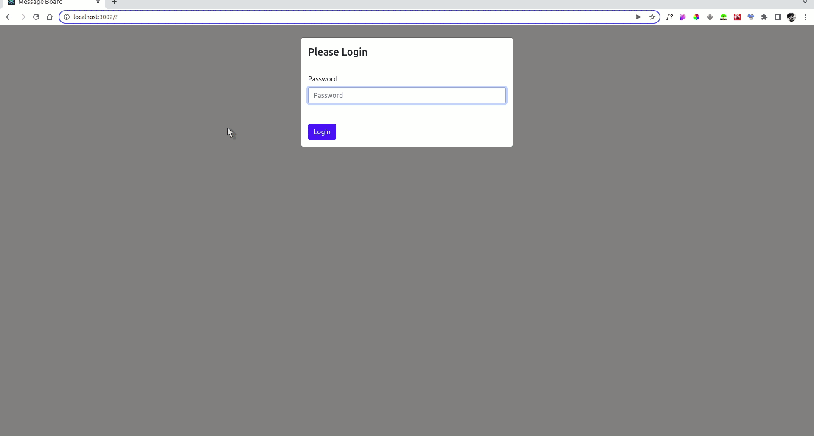

# Message Board
###### A Mini full stack school project

## Demo
  

## What have i achieved:
1. Add functionality to the backend and the frontend so that you can delete individual messages.
   - The frontend should send a DELETE request
2. Add functionality to the frontend so that it remembers your password between page refreshes
3. Add functionality to the backend so that every 10 minutes the password changes to a random number between 0 and 100
4. Add functionality to the frontend so that if the password is wrong during a request, it will ask you for a new password
5. Add functionality to the backend and the frontend so that you can update individual messages.
     - The frontend should send a PUT request
6. Use Lowdb to store the messages in a file

##### Modules/Packages/Libraries used:
    - `react: ^17.0.2`
    - `react-bootstrap: ^2.2.2`
    - `cors: ^2.8.5`
    - `express: ^4.17.3`
    - `lowdb: ^3.0.0`
    - `nanoid: ^3.3.2`
